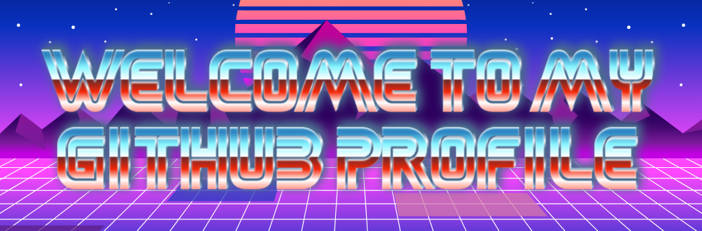

<div align="center">

</div>

<h1 align='center'> ░Ｉ＇ｍ░Ｖｉｎｉｃｉｕｓ░ａｎｄ░Ｉ░ｌｉｋｅ░[̲̅A][̲̅I]░</h1> 

<!--  -->
<div style="width: 100%; overflow: hidden;">
 
    <p>
      <em><ul>
        <li>Computer engineering undergraduate at <a href="https://www.unicamp.br/unicamp/">UNICAMP</a> </li>
        <li>Currently working with reinforcement learning at <a href="https://www.eldorado.org.br/en/">Eldorado Research Institute</a> </li>
        <li>Past experience with particle physics simulations and self-supervised learning </p></li>
      </ul></em>
      <a href="https://www.linkedin.com/in/viniciusandreossi/"></a>
      <a href="https://github.com/viniandrs"></a>
      <!-- <a href="https://huggingface.co/viniandrs"></a> -->
    </p>
</div>

<!--  -->

<h1> 💡 ｉｎｔｅｒｅｓｔｓ　ﾉ刀ｲ乇尺乇丂ｲ丂 </h1>

<table align='center'>
  <tr>
    <td align='center'>
      </img>
    </td>
    <td>
      </img>
    </td>
  </tr>
  <tr align='center'>
    <td>
      <strong>
        Reinforcement <br>
        Learning
      </strong>
    </td>
    <td>
      <strong>
        Bioinspired <br>
        Computing
      </strong>
    </td>
  </tr>
</table>

<h1> 🤓 ｓｋｉｌｌｓ　丂ズﾉﾚﾚ丂</h1>

```python
class Me(nn.Module)
  def __init__(self):
    self.skills = {
      'languages': ['Python', 'C/C++', 'Javascript'],
      'python_libraries': ['PyTorch', 'SKLearn', 'NumPy', 'Pandas'],
      'tools': ['WandB', 'Docker', 'Anaconda', 'SQL']
    }

    self.model = nn.AIDeveloper()

  def forward(self, x):
    return self.model(x)
```

<h1> 📊 ｓｔａｔｓ 丂ㄒ卂ㄒ丂 </h1>

<div class="badges-githubstats">
  <p align="center">
    
    
  </p>
</div>

<table width="100%" align="center">
  <tr>
    <td align="center">Thanks for the visit!</td>
    <td align="center"></td>
  </tr>
</table>
